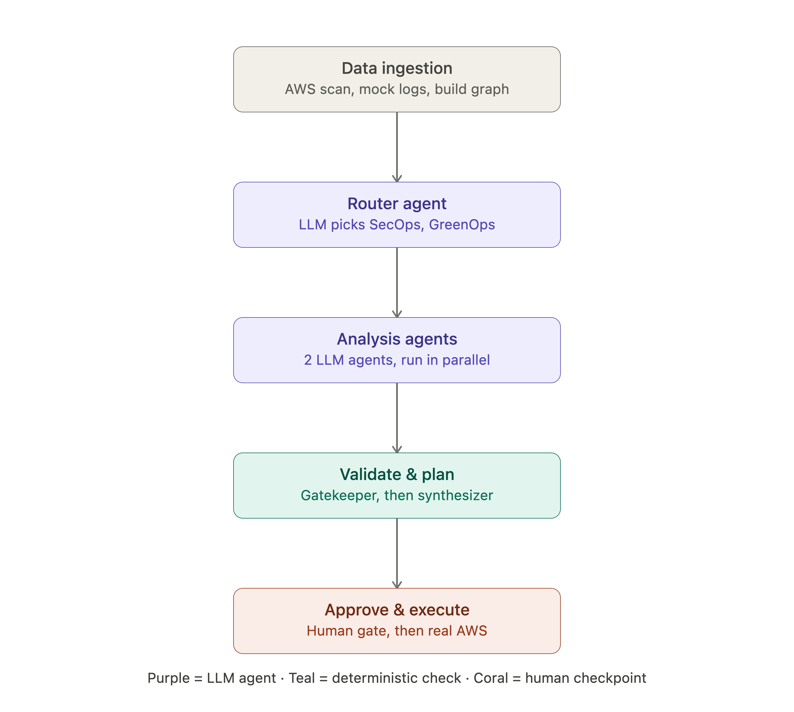
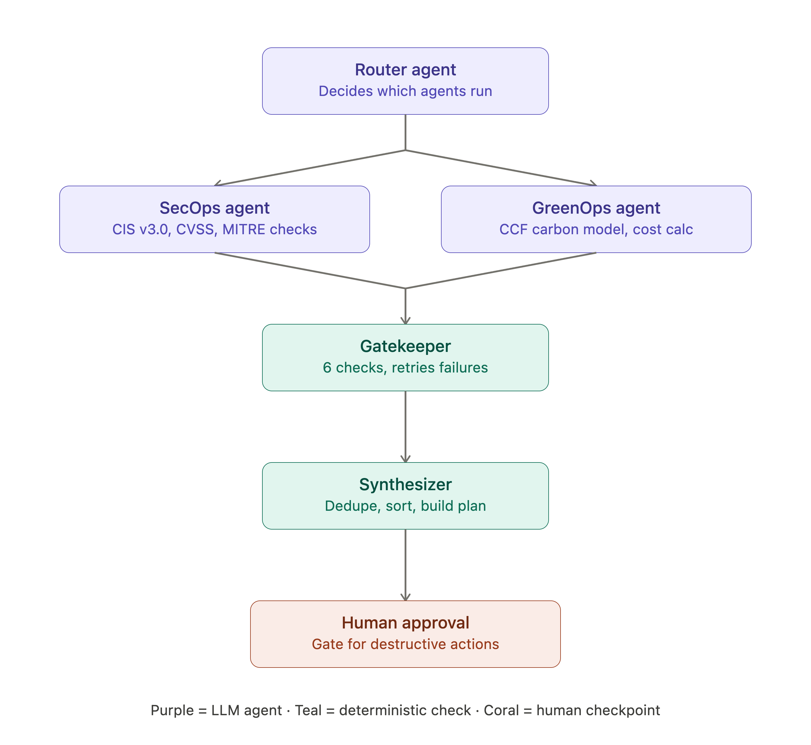

# Feronia

> **AI agents that scan your AWS infrastructure, find security risks, reduce carbon emissions and wasted spend, and fix them with a human approving anything irreversible.**

Built for **Hilti ImagineHack 2026 — Track 2** at Taylor's University.

---

## Team: LOOSERS

| Member | Role |
|--------|------|
| **Charan** | AI Pipeline & Backend |
| **John** | Backend & AWS Integration |
| **Sourya** | Frontend & UX |
| **Jun Wei** | Frontend & UI |

---

## What is Feronia?

Feronia is a cloud intelligence platform that orchestrates **two parallel AI agents** across your AWS infrastructure:

- **SecOps Agent** — maps vulnerabilities to MITRE ATT&CK, checks CIS AWS Foundations Benchmark v2.0+v3.0, detects IAM privilege escalation paths, and ranks findings by CVSS severity.
- **GreenOps Agent** — detects zombie resources, right-sizes overprovisioned instances, quantifies wasted monthly spend, and calculates CO2 reduction opportunities by region.

Every finding flows through a **Human-in-the-Loop (HITL) gate** — the AI pipeline pauses and waits for you to explicitly approve or deny each recommended AWS action before anything is executed. Safe actions (tagging, resizing) and destructive ones (terminating instances, deleting volumes) all go through human review.

---

## The Challenge

**Track 2: Sustainable & Secure Cloud Operations**

Construction technology companies like Hilti run sprawling AWS environments — EC2 fleets, RDS databases, S3 buckets, IAM roles, security groups — all accumulating security debt and idle spend over time. The challenge was to build an autonomous system that could:

1. **Detect** security misconfigurations and sustainability waste automatically
2. **Explain** each finding in plain English so any team member can understand it
3. **Act** on approved findings with real AWS mutations — not just a report

---

## Our Approach

### Architecture Overview

```
AWS Infrastructure
       |
       v
  AWS Scanner (boto3)
  +------------------------------------------------+
  |  Ingestor -> NetworkX Graph Builder -> LLM Router |
  +--------------------+---------------------------+
                       | LangGraph fanout
           +-----------+-----------+
           v                       v
     SecOps Agent           GreenOps Agent
   (Gemini Flash via       (Gemini Flash via
    Grafilab API)           Grafilab API)
           |                       |
           +-----------+-----------+
                       v
                  Gatekeeper
               (pure-Python validator, no LLM)
                       |
                       v
                  Synthesizer
              (deduplicate + deterministic sort)
                       |
                       v
             +-- HITL Gate --+   <- pipeline pauses here
             |  Human Review |
             |  Approve/Deny |
             +------+--------+
                    v  (per-item loop until all resolved)
             Execute on AWS
              (real boto3 mutations)
                    |
                    v
             Final Report
```

### Key Design Decisions

- **LangGraph state machine** with `interrupt()` for true suspend-and-resume HITL — the pipeline state is persisted in memory across HTTP requests, surviving until the user decides.
- **Per-item approval loop** — approving one finding executes only that single AWS action, then the pipeline pauses again for the next. No bulk approvals, no surprises.
- **Pure-Python Gatekeeper** — zero LLM calls for validation. Findings are checked deterministically against the NetworkX graph to catch hallucinated resource IDs before execution.
- **NetworkX DiGraph** — infrastructure resources and relationships are modelled as a directed graph, giving agents structural context (who has permission to what, what connects to what).
- **Real AWS execution** — approved actions hit live boto3 APIs (`ec2.terminate_instances`, `rds.modify_db_instance`, `s3.put_bucket_encryption`, etc.).

---

## Technologies Used

### Backend

| Technology | Purpose |
|------------|---------|
| Python 3.12 | Core language |
| LangGraph >= 1.2.6 | AI agent orchestration, stateful HITL pipeline |
| LangChain + langchain-openai | LLM calls via Grafilab OpenAI-compatible API |
| Gemini Flash (via Grafilab) | LLM powering SecOps, GreenOps & Router agents |
| FastAPI >= 0.111.0 | REST API server — also serves frontend as static files |
| Uvicorn >= 0.30.0 | ASGI server |
| sse-starlette | Server-Sent Events for real-time pipeline streaming |
| boto3 | Live AWS infrastructure scanning & mutation |
| NetworkX >= 3.3 | Infrastructure relationship graph |
| Pydantic >= 2.7 | Strict data validation & models |
| python-dotenv | Environment variable loading |
| Rich | Colourised pipeline console output |

### Frontend

| Technology | Purpose |
|------------|---------|
| Vanilla HTML / CSS / JavaScript | Single-page app with zero framework overhead |
| Vis.js Network | Interactive infrastructure topology canvas |
| Chart.js | Dashboard data visualisations |
| Lucide Icons | UI iconography |

---

## Project Structure

```
Feronia/
+-- packages/
|   +-- backend/
|   |   +-- api.py                   <- FastAPI server + HITL approval endpoints
|   |   +-- main.py                  <- CLI entry point
|   |   +-- aws_scanner.py           <- boto3 live infrastructure scanner
|   |   +-- execute_aws_actions.py   <- Real AWS mutations via boto3
|   |   +-- agents/
|   |   |   +-- router.py            <- LLM log classifier (secops/greenops/both)
|   |   |   +-- secops_agent.py      <- Security AI agent
|   |   |   +-- greenops_agent.py    <- Cost + carbon AI agent
|   |   |   +-- gatekeeper.py        <- Pure-Python finding validator
|   |   +-- graph/
|   |   |   +-- builder.py           <- NetworkX DiGraph from infrastructure state
|   |   |   +-- workflow.py          <- LangGraph pipeline + per-item HITL loop
|   |   +-- pipeline/
|   |   |   +-- ingestor.py          <- Log standardisation + dead-letter handling
|   |   |   +-- synthesizer.py       <- Dedup, sort, action plan generation
|   |   +-- schemas/
|   |   |   +-- models.py            <- All Pydantic models + LangGraph state TypedDict
|   |   +-- data/                    <- Pricing, carbon intensity, IAM privesc combos, mock logs
|   |   +-- requirements.txt         <- Python dependencies
|   |   +-- pyproject.toml           <- Project metadata (uv / pip)
|   +-- frontend/
|       +-- index.html               <- SPA shell
|       +-- pages/                   <- Per-page HTML partials (landing, dashboard, findings, topology)
|       +-- assets/
|           +-- css/                 <- Styles
|           +-- js/                  <- Page logic + canvas rendering
+-- CONTEXT.md                       <- Full architecture notes & design decisions
+-- GUIDE_FOR_BACKEND.md             <- AWS integration guide
+-- .env.example                     <- Environment variable template
```

---

## Dev Setup

### Prerequisites

- Python 3.12+
- `uv` (recommended) or `pip`
- AWS credentials configured (`aws configure` or environment variables)
- A Grafilab API key (or any OpenAI-compatible API endpoint)

### 1. Clone & install dependencies

```bash
git clone <repo-url>
cd Feronia/packages/backend

# Using uv (recommended)
uv sync

# Or using pip
pip install -r requirements.txt
```

### 2. Configure environment variables

```bash
cp .env.example .env
```

Edit `.env` with your values:

```env
# Grafilab (OpenAI-compatible) API
GRAFILAB_API_KEY=your_api_key_here
GRAFILAB_BASE_URL=https://console-api.grafilab.ai/api/oai/v1/models
GRAFILAB_MODEL=gemini/gemini-3.1-flash-lite-preview

# Set to true to auto-execute safe (non-destructive) actions without HITL
AUTO_APPROVE_SAFE_ACTIONS=false

# AWS region
AWS_DEFAULT_REGION=ap-southeast-1

# Optional: named AWS profiles for scanner and executor
# AWS_SCANNER_PROFILE=feronia-scanner
# AWS_EXECUTOR_PROFILE=feronia-executor
```

### 3. Start the development server

```bash
# From packages/backend
uvicorn api:app --reload --port 8000
```

The app is now live at **http://localhost:8000**

The FastAPI server serves the entire frontend as static files — no separate dev server needed.

### 4. Run a scan

1. Open **http://localhost:8000** in your browser.
2. Click **Start a scan** on the landing page.
3. The pipeline runs in the background — SecOps and GreenOps agents scan your live AWS account in parallel.
4. The pipeline pauses at the Human-in-the-Loop gate and all findings populate in the Dashboard.
5. Click any finding to open the detail modal.
6. Click **Approve & Execute** to apply the recommended AWS fix immediately, or **Deny** to skip it.
7. The pipeline processes findings one at a time until all are resolved, then generates a final report.

### 5. Run tests (optional)

```bash
cd packages/backend
pytest tests/ -v
```

---

## Important Notes

- **Destructive actions are real and irreversible.** `terminate_instance`, `delete_volume`, `delete_database`, and `delete_iam_role` execute against your live AWS account the moment you click Approve. If you destroy something accidentally, run `terraform apply` again to restore it.
- **`enable_encryption` on RDS/EBS** cannot be applied in-place — AWS requires a snapshot-copy-restore cycle. Feronia defaults to tagging the resource as flagged-for-encryption (`SIMPLE_ENCRYPTION_MODE = True` in `execute_aws_actions.py`). Set to `False` only after rehearsing and timing the full restore flow.
- **The dashboard is always empty on startup.** Any previous scan results are cleared when the server restarts — this is intentional.
- **Logs are scripted mock data.** `data/mock_logs.json` contains crafted CloudTrail-style events. The infrastructure scan is live; the log content is scripted for demo reproducibility.

---

## Architecture Diagrams



